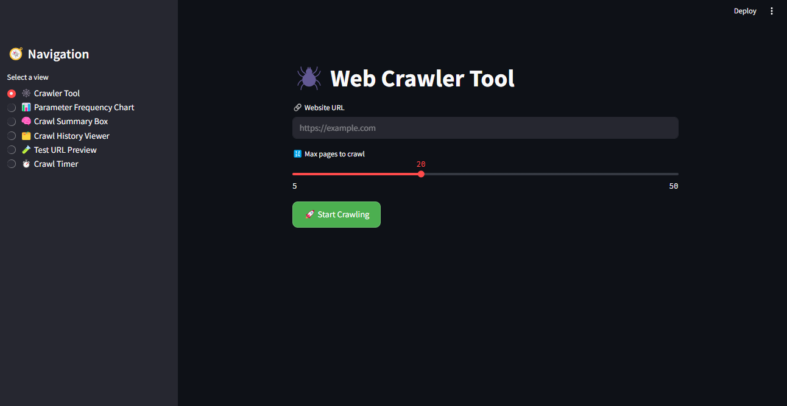
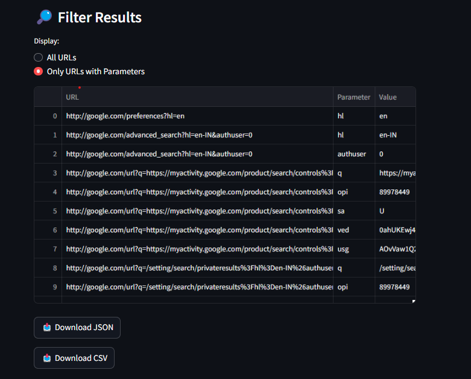
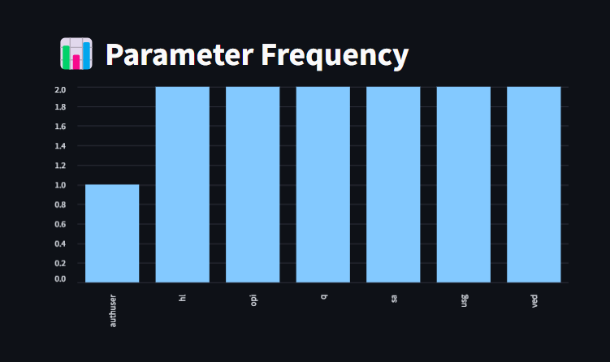
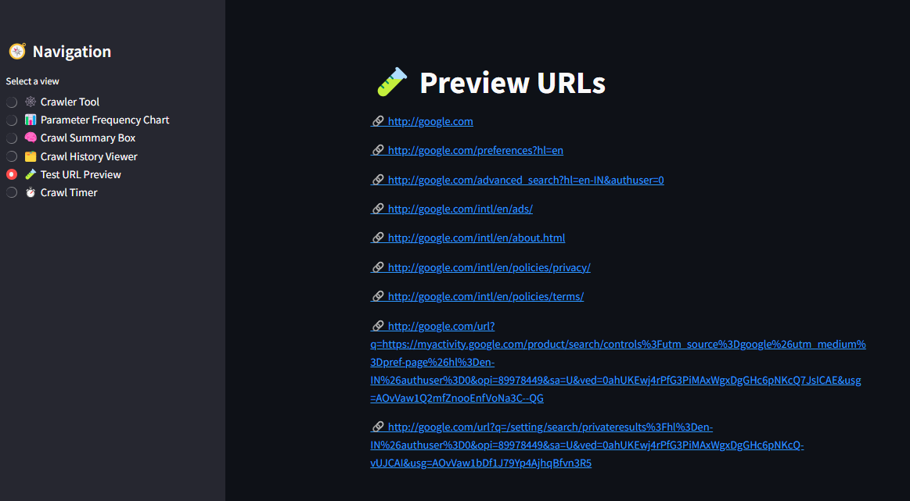

 HEAD
# 🕸️ Web Crawler Tool

A powerful and user-friendly **Streamlit** app that crawls websites, extracts internal URLs, and identifies **URL parameters**. Visualize and filter results easily with built-in charts and download options.


## 🚀 Features

- 🔗 Crawl internal links up to a chosen depth
- 🧠 Extract and display URL parameters
- 📊 Visualize parameter frequency with charts
- 📥 Download results as JSON or CSV
- 🧾 Crawl history stored in session
- ⏱️ Timer to track crawl duration
- 🗂️ Sidebar navigation with interactive UI


## 🖼️ Live 

> (https://web-crawler-tool-d54aefczarbkseie3yp47m.streamlit.app/)


## 📸 Screenshots

### 🏠 Home Page


### 🔎 Crawl Results


### 🔎 Crawl Summary


### 🔎 Crawl Summary


### 🔎 Crawl Summary



## 🛠️ Installation

```bash
# Clone the repository
git clone https://github.com/YOUR_USERNAME/web-crawler-tool.git
cd web-crawler-tool

# Create virtual environment
python -m venv venv
venv\Scripts\activate  # On Windows

# Install dependencies
pip install -r requirements.txt

# Run the app
streamlit run app.py

# Web-Crawler-Tool
A Streamlit-based tool to crawl URLs and extract parameters.
 ec803ac3fbe3df60cd4f1fd681bd7de9ce06b3ce
